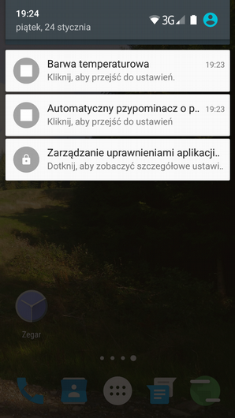

# protector_modules
### Thesis alfa project tested on elephone P9000

  This bachelor's thesis code concern a mobile application in Android system operation. This is reason, why application has a Polish language GUI. The aim of app is maintain psychophysical health by remanding about pauses and color temperature and brightness regulation. App includes three independent modules which each other has apart, unique icon. One of the module named "automaticpauses" Includes two countdown timers named "micropause" and "macropasue". The task of micropause countdown timer is remanding about pause often. For example every minute. The latter is remanding much more rarely than aforementioned. Of course these variables is contractual. Below screens shows working the application.

  
  <code>-</code>
  

  
  <code>-</code>
  

 
  The second module named "colortemperature" includes a logical device overlay, which has special algorithm enumerating color temperature using three colors RGB. Furthermore, the one has three buttons: color temperature, intensity, brightness level. The buttons may be regulating manually or automatically by light sensor of android system. There are four ranges of lumen(lx).

  
  <code>-</code>
  

 
### Technology

- Android Studio 3.5.
- Java language.
- Gradle 4.0.1.
- tested on Elephone P9000 Android 6.0 Marshmallow.

### Sources 

https://codinginflow.com/tutorials/android/countdowntimer/part-1-time-input Countdown Timer – Coding in Flow. Retrieved 03.01.2020.

https://github.com/jeremija/ColorTemperature Jeremija, Color Temperature. The example of color temperature convert in RGB values in Java language. Retrieved 6.01.2020.

